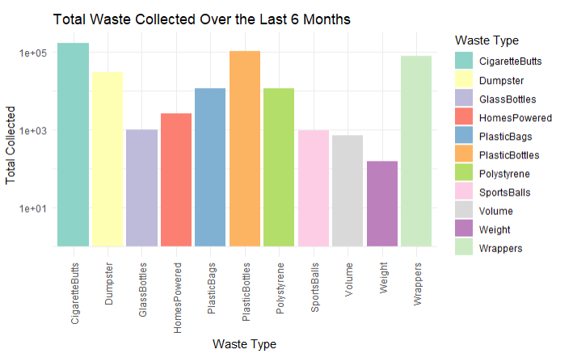
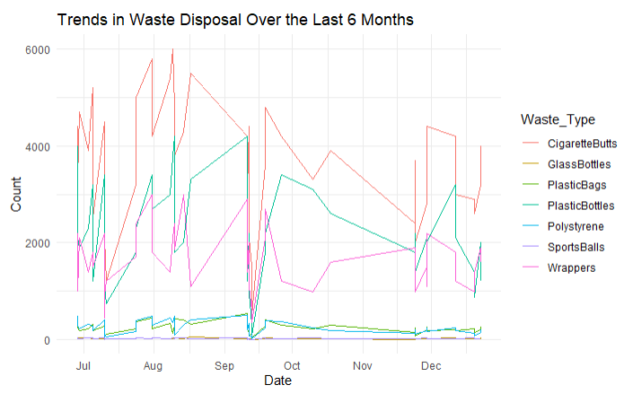
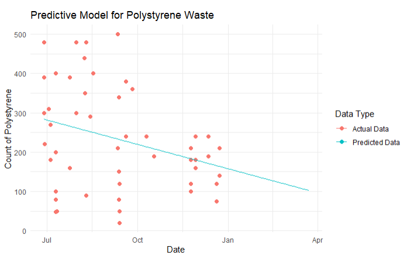
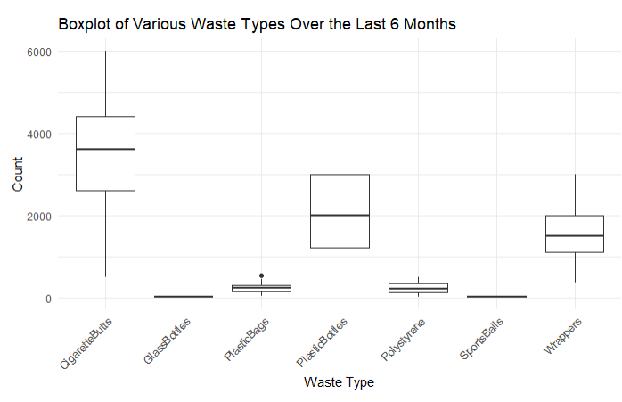
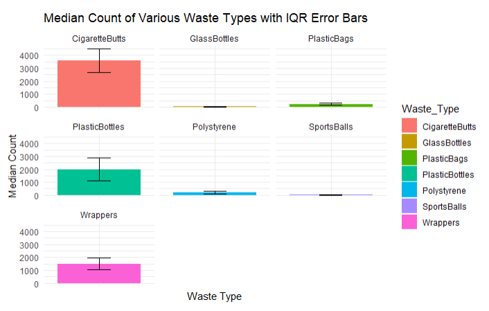

# Introduction

Baltimore's Trash Wheel project represents an innovative and vital environmental initiative aimed at tackling urban water pollution. Launched in 2014 by the Waterfront Partnership of Baltimore with support from the Maryland Port Administration, the project uses solar and hydro-powered devices known as Trash Wheels to intercept and remove trash from rivers and streams before it can reach the Chesapeake Bay. To date, these devices have collected over one million pounds of debris, including plastic bottles, polystyrene containers, and cigarette butts, which are notorious for harming aquatic life and polluting urban waters.

The dataset, `trashwheel.csv`, chronicles the daily operations of these Trash Wheels. It meticulously records the volume and weight of trash collected, categorized by type and indexed by date, across multiple locations in Baltimore. This data not only underscores the operational success of the Trash Wheels but also highlights seasonal and event-driven fluctuations in urban waste generation and collection.

## Importance of the Dataset

This dataset is crucial for several reasons:

- **Environmental Impact**: It provides empirical evidence of the quantity and types of urban waste that can be intercepted from urban waterways, offering insights into the effectiveness of innovative pollution control technologies.
- **Policy and Planning**: By analyzing trends and patterns in the data, policymakers and urban planners can better understand the sources and scales of water pollution, leading to more targeted and effective environmental regulations and initiatives.
- **Public Awareness and Education**: Disseminating findings from this data can enhance public awareness about the impact of littering and the benefits of recycling, potentially fostering more environmentally responsible behaviors.

## Questions and our approach
1. What are the types of waste composition that has their weight/volume increase in the last 6 months?

- Introduction:
This report examines the composition of waste collected over the last six months, focusing on specific categories: Plastic Bottles, Polystyrene, Cigarette Butts, Glass Bottles, Plastic Bags, Wrappers, and Sports Balls. The goal is to determine which types of waste have seen increases in the collected amount. Understanding these trends is vital for waste management agencies to refine their operations and for policymakers to gauge the effectiveness of current environmental regulations and the impact of societal behavior on waste production. This inquiry is driven by the urgent need for environmental sustainability solutions in the face of growing urban populations, which typically result in higher waste generation.

- Approach:
We used several plots and methods for this question.
    - Bar Chart: This chart provides an immediate visual comparison of the total waste collected by type over the last six months. To accommodate the wide range of values, we applied a logarithmic scale, improving visibility for categories with smaller volumes.
    
    
    - Line and Scatter Plots: Although the bar chart showed the volume for each waste type, it lacked temporal details necessary for trend analysis. Initially, a line chart was used, but it was cluttered due to the diversity of waste types. We opted for a scatter plot with linear regression to clarify the trends over time.

      
    
    - A box plot was also implemented for some outlier analysis. However, it does not give too much effective since there was only a few mistake probably from wrong label.
      

- Analysis:
```{r}
library(dplyr)
library(lubridate)
library(ggplot2)
library(tidyr)

# Read the CSV file
data <- read.csv("trashwheel.csv")
data$Date <- as.Date(data$Date, format = "%m/%d/%Y")

#filter data for the last 6 months
recent_data <- data %>%
  filter(Date > max(Date) %m-% months(6))

#calculate total number of encountered waste for each category by summing the column.
sums_recent <- recent_data %>%
  select(-Year) %>%
  select(-Date) %>%
  summarise(across(where(is.numeric), sum, na.rm = TRUE))

#format
sums_recent <- pivot_longer(sums_recent, cols = everything(), names_to = "Waste_Type", values_to = "Total")
```

```{r}
#bar chart
ggplot(sums_recent, aes(x = Waste_Type, y = Total, fill = Waste_Type)) +
  geom_bar(stat = "identity") +
  scale_y_log10() +
  theme_minimal() +
  theme(axis.text.x = element_text(angle = 90, vjust = 0.5, hjust=1)) +
  labs(title = "Total Waste Collected Over the Last 6 Months",
       x = "Waste Type",
       y = "Total Collected",
       fill = "Waste Type") +
  scale_fill_brewer(palette = "Set3")
```

```{r}
#get the number of collected waste for each type in a day for the simple linear regression
recent_data_long <- recent_data %>%
  select(Date, PlasticBottles, Polystyrene, CigaretteButts, GlassBottles,
         PlasticBags, Wrappers, SportsBalls) %>%
  gather(key = "Waste_Type", value = "Count", -Date)

recent_data_long$Date_numeric <- as.numeric(recent_data_long$Date - min(recent_data_long$Date))

# List of waste types to model
waste_types <- c("Polystyrene", "CigaretteButts", "GlassBottles", "PlasticBags", "Wrappers", "SportsBalls")

# Initialize an empty list to store models
models <- list()

# Loop over waste types, fit model, and store
for(waste in waste_types) {
  model <- lm(Count ~ Date_numeric, data = filter(recent_data_long, Waste_Type == waste))
  models[[waste]] <- model
}

# Display summaries of all models
lapply(models, summary)

# Function to create prediction plots for a given waste type
create_prediction_plot <- function(waste) {
  # Extending the prediction range to include the next 3 months
  max_date_numeric <- max(recent_data_long$Date_numeric)
  future_extend <- as.numeric((max(recent_data_long$Date) %m+% months(3)) - max(recent_data_long$Date))
  prediction_data <- data.frame(Date_numeric = seq(min(recent_data_long$Date_numeric), max_date_numeric + future_extend, by = 1))
  prediction_data$Predicted_Count <- predict(models[[waste]], newdata = prediction_data)
  prediction_data$Date <- min(recent_data_long$Date) + prediction_data$Date_numeric * days(1)

  # Plotting
  p <- ggplot(filter(recent_data_long, Waste_Type == waste), aes(x = Date, y = Count)) +
    geom_point(aes(color = "Actual Data"), size = 2) +
    geom_line(data = prediction_data, aes(x = Date, y = Predicted_Count, color = "Predicted Data")) +
    theme_minimal() +
    labs(title = paste("Predictive Model for", waste, "Waste"),
         x = "Date",
         y = paste("Count of", waste),
         color = "Data Type")

  return(p)
}

# Use the function to create plots
plot_list <- lapply(waste_types, create_prediction_plot)
plot_list[[1]]
plot_list[[2]]
plot_list[[3]]
plot_list[[4]]
plot_list[[5]]
plot_list[[6]]
```

For extra insight such as what waste type is dominant to the other, I implemented a multi-facet barchart with IQR represented as a error bar.

```{r}
summary_stats <- recent_data_long %>%
  group_by(Waste_Type) %>%
  summarise(Median_Count = median(Count),
            IQR = IQR(Count),
            Lower_Whisker = quantile(Count, 0.25) - 1.5 * IQR(Count),
            Upper_Whisker = quantile(Count, 0.75) + 1.5 * IQR(Count),
            Mean_Count = mean(Count))


# Calculate error margin for IQR (taking half of the IQR as the error margin for simplicity)
summary_stats <- summary_stats %>%
  mutate(Error_Margin = IQR / 2)

# Create a multi-faceted bar chart with error bars
ggplot(summary_stats, aes(x = Waste_Type, y = Median_Count, fill = Waste_Type)) +
  geom_bar(stat = "identity", position = position_dodge()) +
  geom_errorbar(aes(ymin = Median_Count - Error_Margin, ymax = Median_Count + Error_Margin), width = 0.25) +
  facet_wrap(~ Waste_Type, scales = "free_x") +
  theme_minimal() +
  labs(title = "Median Count of Various Waste Types with IQR Error Bars",
       x = "Waste Type",
       y = "Median Count") +
  theme(axis.text.x = element_blank(), axis.ticks.x = element_blank()) 
```

- Discussion:

The regression analysis of scatter plots revealed divergent trends in waste generation, highlighting both positive environmental progress and areas needing improvement. The variability in trends across categories reflects the complex factors influencing waste generation, from regulatory changes to seasonal behaviors. These insights are crucial for shaping effective waste management strategies and promoting sustainable community practices.

Moreover, the multi-facet bar chart provide a deeper understanding of waste prevalence and variation in collection figures. This data can guide waste management and recycling initiatives to focus on areas with high waste production or significant collection variability, such as launching public awareness campaigns for proper disposal practices or enhancing recycling efforts.

## Challenges Associated with the Dataset

Despite the value of this dataset, several issues warrant attention when interpreting its findings:

- **Completeness**: There are gaps in the dataset on days when the Trash Wheels were inactive due to maintenance or operational issues, which could skew analysis of long-term trends.
- **Accuracy**: The potential for human error in data entry and variations in the accuracy of measurement methods might affect the reliability of the data.
- **Consistency**: Over the years, modifications to data collection methodologies might have introduced inconsistencies that complicate comparisons over time.
- **Environmental Biases**: External factors such as weather conditions—particularly heavy rainfalls that can spike debris flow—need to be considered as they can significantly influence the volume of waste collected.

These factors must be carefully considered to ensure that the analysis remains robust and that conclusions drawn are both reliable and actionable. The subsequent sections of this document will delve into a detailed examination of the dataset using statistical methods and visualizations to assess the efficacy and impact of the Trash Wheel project on Baltimore's urban waterways.

## Conclusion

In summary, the Trash Wheel project has proven to be an effective environmental safeguard for Baltimore's waterways, successfully intercepting over one million pounds of debris and preventing it from polluting the Chesapeake Bay. Our analysis of the trashwheel.csv dataset highlights not only the types and quantities of collected waste but also reveals significant seasonal and event-driven fluctuations in waste accumulation. These findings underscore the importance of the Trash Wheels in urban waste management and environmental protection.

To build on these insights, further steps could include enhancing data collection methods to fill gaps and improve accuracy, and expanding public education campaigns to reduce littering and increase recycling efforts. Additionally, implementing more Trash Wheels at strategic locations could further decrease the pollutant load entering water bodies. Such initiatives would not only bolster the current project's success but also align with LeadUp's goals to cultivate leadership qualities among youth by encouraging proactive involvement in sustainable and community-focused actions.