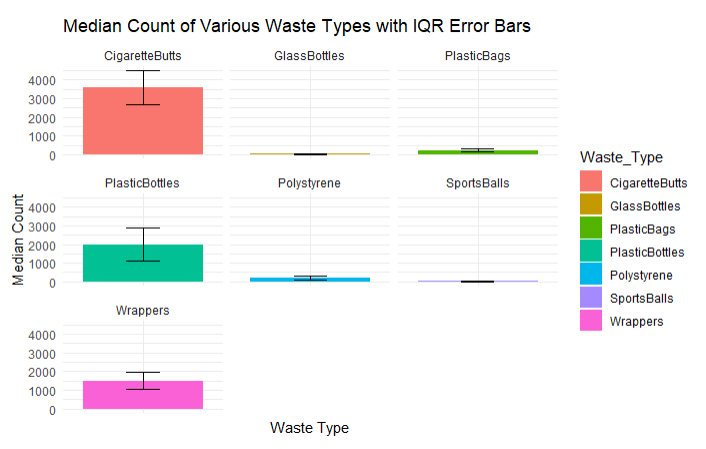
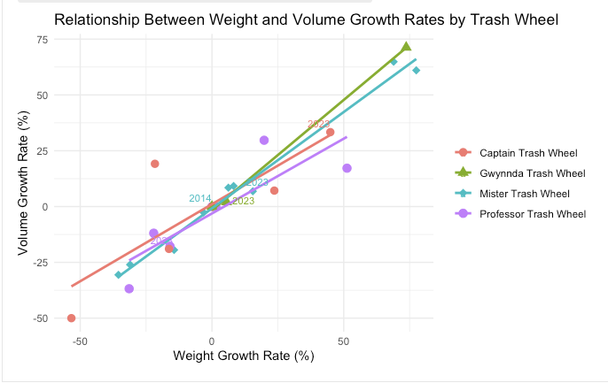
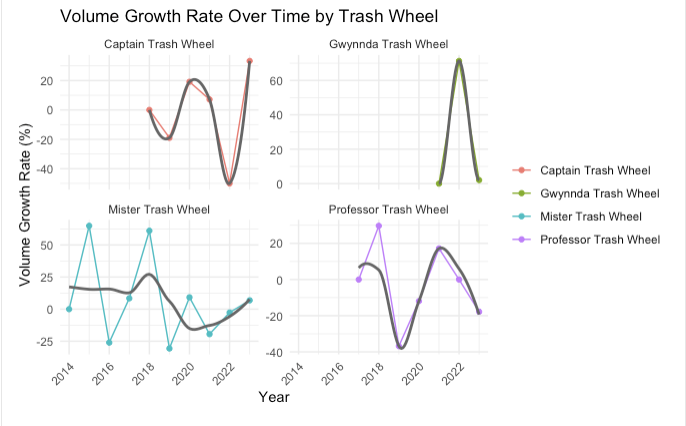
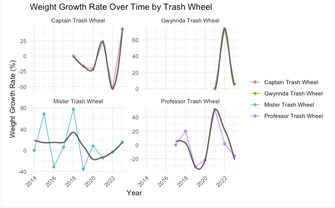

# Introduction

Baltimore's Trash Wheel project represents an innovative and vital
environmental initiative aimed at tackling urban water pollution.
Launched in 2014 by the Waterfront Partnership of Baltimore with support
from the Maryland Port Administration, the project uses solar and
hydro-powered devices known as Trash Wheels to intercept and remove
trash from rivers and streams before it can reach the Chesapeake Bay. To
date, these devices have collected over one million pounds of debris,
including plastic bottles, polystyrene containers, and cigarette butts,
which are notorious for harming aquatic life and polluting urban waters.

The dataset, `trashwheel.csv`, chronicles the daily operations of these
Trash Wheels. It meticulously records the volume and weight of trash
collected, categorized by type and indexed by date, across multiple
locations in Baltimore. This data not only underscores the operational
success of the Trash Wheels but also highlights seasonal and
event-driven fluctuations in urban waste generation and collection.

## Importance of the Dataset

This dataset is crucial for several reasons:

-   **Environmental Impact**: It provides empirical evidence of the
    quantity and types of urban waste that can be intercepted from urban
    waterways, offering insights into the effectiveness of innovative
    pollution control technologies.
-   **Policy and Planning**: By analyzing trends and patterns in the
    data, policymakers and urban planners can better understand the
    sources and scales of water pollution, leading to more targeted and
    effective environmental regulations and initiatives.
-   **Public Awareness and Education**: Disseminating findings from this
    data can enhance public awareness about the impact of littering and
    the benefits of recycling, potentially fostering more
    environmentally responsible behaviors.

## Questions and our approach

1.  What are the types of waste composition that has their weight/volume
    increase in the last 6 months?

-   **Introduction:** This report examines the composition of waste
    collected over the last six months, focusing on specific categories:
    Plastic Bottles, Polystyrene, Cigarette Butts, Glass Bottles,
    Plastic Bags, Wrappers, and Sports Balls. The goal is to determine
    which types of waste have seen increases in the collected amount.
    Understanding these trends is vital for waste management agencies to
    refine their operations and for policymakers to gauge the
    effectiveness of current environmental regulations and the impact of
    societal behavior on waste production. This inquiry is driven by the
    urgent need for environmental sustainability solutions in the face
    of growing urban populations, which typically result in higher waste
    generation.

-   **Approach:** We used several plots and methods for this question.

    -   **Bar Chart:** This chart provides an immediate visual
        comparison of the total waste collected by type over the last
        six months. To accommodate the wide range of values, we applied
        a logarithmic scale, improving visibility for categories with
        smaller volumes. 

    -   **Line and Scatter Plots:** Although the bar chart showed the
        volume for each waste type, it lacked temporal details necessary
        for trend analysis. Initially, a line chart was used, but it was
        cluttered due to the diversity of waste types. We opted for a
        scatter plot with linear regression to clarify the trends over
        time.

         

    -   A box plot was also implemented for some outlier analysis.
        However, it does not give too much effective since there was
        only a few mistake probably from wrong label.
        

-   **Analysis:**

```{r}
library(dplyr)
library(lubridate)
library(ggplot2)
library(tidyr)

# Read the CSV file
data <- read.csv("trashwheel.csv")
data$Date <- as.Date(data$Date, format = "%m/%d/%Y")

#filter data for the last 6 months
recent_data <- data %>%
  filter(Date > max(Date) %m-% months(6))

#calculate total number of encountered waste for each category by summing the column.
sums_recent <- recent_data %>%
  select(-Year) %>%
  select(-Date) %>%
  summarise(across(where(is.numeric), sum, na.rm = TRUE))

#format
sums_recent <- pivot_longer(sums_recent, cols = everything(), names_to = "Waste_Type", values_to = "Total")
```

```{r}
#bar chart
ggplot(sums_recent, aes(x = Waste_Type, y = Total, fill = Waste_Type)) +
  geom_bar(stat = "identity") +
  scale_y_log10() +
  theme_minimal() +
  theme(axis.text.x = element_text(angle = 90, vjust = 0.5, hjust=1)) +
  labs(title = "Total Waste Collected Over the Last 6 Months",
       x = "Waste Type",
       y = "Total Collected",
       fill = "Waste Type") +
  scale_fill_brewer(palette = "Set3")
```

```{r}
#get the number of collected waste for each type in a day for the simple linear regression
recent_data_long <- recent_data %>%
  select(Date, PlasticBottles, Polystyrene, CigaretteButts, GlassBottles,
         PlasticBags, Wrappers, SportsBalls) %>%
  gather(key = "Waste_Type", value = "Count", -Date)

recent_data_long$Date_numeric <- as.numeric(recent_data_long$Date - min(recent_data_long$Date))

# List of waste types to model
waste_types <- c("Polystyrene", "CigaretteButts", "GlassBottles", "PlasticBags", "Wrappers", "SportsBalls")

# Initialize an empty list to store models
models <- list()

# Loop over waste types, fit model, and store
for(waste in waste_types) {
  model <- lm(Count ~ Date_numeric, data = filter(recent_data_long, Waste_Type == waste))
  models[[waste]] <- model
}

# Display summaries of all models
lapply(models, summary)

# Function to create prediction plots for a given waste type
create_prediction_plot <- function(waste) {
  # Extending the prediction range to include the next 3 months
  max_date_numeric <- max(recent_data_long$Date_numeric)
  future_extend <- as.numeric((max(recent_data_long$Date) %m+% months(3)) - max(recent_data_long$Date))
  prediction_data <- data.frame(Date_numeric = seq(min(recent_data_long$Date_numeric), max_date_numeric + future_extend, by = 1))
  prediction_data$Predicted_Count <- predict(models[[waste]], newdata = prediction_data)
  prediction_data$Date <- min(recent_data_long$Date) + prediction_data$Date_numeric * days(1)

  # Plotting
  p <- ggplot(filter(recent_data_long, Waste_Type == waste), aes(x = Date, y = Count)) +
    geom_point(aes(color = "Actual Data"), size = 2) +
    geom_line(data = prediction_data, aes(x = Date, y = Predicted_Count, color = "Predicted Data")) +
    theme_minimal() +
    labs(title = paste("Predictive Model for", waste, "Waste"),
         x = "Date",
         y = paste("Count of", waste),
         color = "Data Type")

  return(p)
}

# Use the function to create plots
plot_list <- lapply(waste_types, create_prediction_plot)
plot_list[[1]]
plot_list[[2]]
plot_list[[3]]
plot_list[[4]]
plot_list[[5]]
plot_list[[6]]
```

For extra insight such as what waste type is dominant to the other, I
implemented a multi-facet barchart with IQR represented as a error bar.

```{r}
summary_stats <- recent_data_long %>%
  group_by(Waste_Type) %>%
  summarise(Median_Count = median(Count),
            IQR = IQR(Count),
            Lower_Whisker = quantile(Count, 0.25) - 1.5 * IQR(Count),
            Upper_Whisker = quantile(Count, 0.75) + 1.5 * IQR(Count),
            Mean_Count = mean(Count))


# Calculate error margin for IQR (taking half of the IQR as the error margin for simplicity)
summary_stats <- summary_stats %>%
  mutate(Error_Margin = IQR / 2)

# Create a multi-faceted bar chart with error bars
ggplot(summary_stats, aes(x = Waste_Type, y = Median_Count, fill = Waste_Type)) +
  geom_bar(stat = "identity", position = position_dodge()) +
  geom_errorbar(aes(ymin = Median_Count - Error_Margin, ymax = Median_Count + Error_Margin), width = 0.25) +
  facet_wrap(~ Waste_Type, scales = "free_x") +
  theme_minimal() +
  labs(title = "Median Count of Various Waste Types with IQR Error Bars",
       x = "Waste Type",
       y = "Median Count") +
  theme(axis.text.x = element_blank(), axis.ticks.x = element_blank()) 
```



- **Discussion**:
The regression analysis of scatter plots revealed divergent trends in
waste generation, highlighting both positive environmental progress and
areas needing improvement. The variability in trends across categories
reflects the complex factors influencing waste generation, from
regulatory changes to seasonal behaviors. These insights are crucial for
shaping effective waste management strategies and promoting sustainable
community practices.

Moreover, the multi-facet bar chart provide a deeper understanding of
waste prevalence and variation in collection figures. This data can
guide waste management and recycling initiatives to focus on areas with
high waste production or significant collection variability, such as
launching public awareness campaigns for proper disposal practices or
enhancing recycling efforts.

2.  Which type of trash wheels have a highest performance, throughout
    the years, analyse the improvement of the usage of different trash
    wheel?

-   **Introduction:** The analysis scrutinizes the efficiency of trash
    wheels over the years, focusing on the annual total weight and
    volume of collected waste. It highlights significant variations in
    performance among different trash wheels, with notable improvements
    observed. The Gwynnda Trash Wheel, in particular, demonstrates a
    marked increase in waste collection efficiency. Graphical
    representations of yearly performance growth rates reveal trends in
    operational effectiveness. This report underscores the pivotal role
    of trash wheels in environmental management, showcasing their
    evolving impact on waste collection and the necessity for continuous
    technological advancements to enhance their efficacy in pollution
    reduction and resource conservation.

-   **Approach:** We used several plots and methods for this question.

    -   First, to delve deeper into the analysis of waste collection
        efficiency and effectiveness, we calculate the total weight and
        volume of waste collected within a year. This step is crucial
        for understanding the scale of waste management efforts and
        their year-on-year progression.

        -   We have created 2 new variables, which are `TotalWeight` and
            `TotalVolume` calculated by taking sum of weight and volume
            within a year for each Trash Wheel.

    ```{r}
    #  Data segmentation by Trash Wheel by Year
    trashwheel_segments <- trashwheel_data %>%
      group_by(Name, Year) %>%
      summarise(
        TotalWeight = sum(Weight, na.rm = TRUE),
        TotalVolume = sum(Volume, na.rm = TRUE)
      )
    trashwheel_segments
    ```

    -   now we plot the line graph to visualize the performance in terms
        of `TotalWeight` and `TotalVolume` of trash wheel over years

    ```{r}
    # Time-Series Analysis: Performance of each Trash Wheel over time
    ggplot(trashwheel_segments, aes(x = Year, y = TotalWeight, group = Name, color = Name)) +
      geom_line() +
      geom_point(size = 3, shape = 21, fill = "white") + # Using filled points for better visibility
      theme_minimal() +
      labs(title = "Annual Total Weight of Collected Waste by Trash Wheel",
           x = "Year", y = "Total Weight (Tons)") +
      theme(legend.title = element_blank(), # Removing the legend title for clarity
            legend.position = "bottom", # Positioning legend at the bottom for easy comparison
            axis.text.x = element_text(angle = 45, hjust = 1)) 

    ggplot(trashwheel_segments, aes(x = Year, y = TotalVolume, group = Name, color = Name)) +
      geom_line() +
      geom_point(size = 3, shape = 21, fill = "white") + # Using filled points for better visibility
      theme_minimal() +
      labs(title = "Annual Total Volume of Collected Waste by Trash Wheel",
           x = "Year", y = "Total Volume (Cubic Yards)") +
      theme(legend.title = element_blank(), # Removing the legend title for clarity
            legend.position = "bottom", # Positioning legend at the bottom for easy comparison
            axis.text.x = element_text(angle = 45, hjust = 1)) 
    ```

    

    

    -   **Analysis:**

        -   This graphs illustrate the annual waste collection
            performance of various trash wheels from 2014 to 2023,
            measured by total weight and volume.

        -   The first graph represents the "Annual Total Weight of
            Collected Waste by Trash Wheel" in tons. The Gwynnda Trash
            Wheel has a strong upward trend, indicating a significant
            increase in performance over time, particularly after 2021.
            In comparison, the Captain and Professor Trash Wheels show
            very flat trends with little changes, showing constant but
            not dramatically enhanced performance. The Mister Trash
            Wheel has a fluctuating pattern, with peaks indicating years
            of excellent performance followed by falls.

        -   The second graph depicts patterns in total volume that are
            comparable to those seen in the weight graph (we will
            explain why later in this report). The Gwynnda Trash Wheel
            has the most noticeable increase, showing that it not only
            gathers heavier garbage but also more in volume. The other
            garbage wheels have a steady volume with small variations
            over time.

        -   Based on these data, we can see that the Gwynnda Trash Wheel
            exceeds the others in terms of weight and volume of garbage
            collected, indicating a consistent growth in efficiency and
            efficacy. Both graphs show that garbage wheel performance
            has improved with time, notably with Gwynnda, indicating the
            successful adoption of enhancements or more effective waste
            collection tactics for this wheel.

    -   Now, plot a line graph to illustrate the performance of each
        Trash Wheel over time, highlighting trends and year-on-year
        changes in waste collection, we will need to calculate the rate
        of change in both weight and volume. For this part, our team
        make usage of creating 2 new variables
        `Yearly Performance Growth Rate`, calculated as the percentage
        change in `Weight` and `Volume` from one year to the next, to
        quantify performance improvements or declines.

```{r}
# Calculating Yearly Performance Growth Rate
trashwheel_segments <- trashwheel_segments %>%
  group_by(Name) %>%
  arrange(Year) %>%
  mutate(
    WeightGrowthRate = (TotalWeight / lag(TotalWeight) - 1) * 100, # Growth weight rate 
    VolumeGrowthRate = (TotalVolume / lag(TotalVolume) - 1) * 100 # Growth volume rate 
  ) %>% 
  replace_na(list(WeightGrowthRate = 0, VolumeGrowthRate = 0)) %>%  # means that at the time when a trash wheel start to be used, we set the intial value for the rate equals to 0. 
  arrange(desc(WeightGrowthRate), desc(VolumeGrowthRate))
trashwheel_segments
```


-   **Analysis:**

    -   The table demonstrates the performance of individual trash
        wheels in terms of total weight and volume collected, as well as
        their growth rates over time. Notably, Mister Trash Wheel saw
        the highest weight and volume growth rates in 2018, whilst
        Gwynnda Trash Wheel continues to ascend, dominating the list in
        2022 despite a reduction in growth rate the following year.

    -   On the other side, the Professor Trash Wheel and Captain Trash
        Wheel have demonstrated negative growth rates in recent years,
        indicating a decrease in efficiency or a reduction in rubbish
        available for collection.

```{r}
library(ggplot2)
library(dplyr)
library(ggrepel)

# Assigning unique shapes to each Trash Wheel
shapes <- c(16, 17, 18, 19) # Circle, Triangle, Square, Diamond

ggplot(trashwheel_segments, aes(x = WeightGrowthRate, y = VolumeGrowthRate, color = Name)) +
  geom_point(aes(shape = Name), size = 3) + 
  geom_smooth(method = "lm", se = FALSE) +
  geom_text_repel(aes(label = if_else(Year == max(Year) | Year == min(Year), as.character(Year), "")),
                  nudge_y = 0.05, size = 3, 
                  segment.color = 'grey50') + # Add labels to first and last years for clarity
  scale_shape_manual(values = shapes) + # Apply the shapes
  theme_minimal() +
  labs(title = "Relationship Between Weight and Volume Growth Rates by Trash Wheel",
       x = "Weight Growth Rate (%)", y = "Volume Growth Rate (%)") +
  theme(legend.title = element_blank()) 
```



-   **Analysis:**

    -   The graph shows a generally linear relationship between weight
        and volume changes, demonstrating that as weight increases, so
        does volume.

    -   Given this finding, concentrating on a single feature may
        simplify our study. Nonetheless, we will continue to investigate
        these features in order to identify any potentially fascinating
        events that may develop.

```{r}
library(ggplot2)

# Plotting Weight Growth Rate over Time for each Trash Wheel
ggplot(trashwheel_segments, aes(x = Year, y = WeightGrowthRate, group = Name)) +
  geom_line(aes(color = Name)) +
  geom_point(aes(color = Name)) +
  geom_smooth(se = FALSE, method = "loess", color = "gray40") + # Add a smooth trend line
  facet_wrap(~Name, scales = "free_y") + # Faceting by Trash Wheel
  theme_minimal() +
  labs(title = "Weight Growth Rate Over Time by Trash Wheel",
       x = "Year", y = "Weight Growth Rate (%)") +
  theme(legend.title = element_blank() , 
        axis.text.x = element_text(angle = 45, hjust = 1))

# Plotting Volume Growth Rate over Time for each Trash Wheel
ggplot(trashwheel_segments, aes(x = Year, y = VolumeGrowthRate, group = Name)) +
  geom_line(aes(color = Name)) +
  geom_point(aes(color = Name)) +
  geom_smooth(se = FALSE, method = "loess", color = "gray40") + # Add a smooth trend line
  facet_wrap(~Name, scales = "free_y") + # Faceting by Trash Wheel
  theme_minimal() +
  labs(title = "Volume Growth Rate Over Time by Trash Wheel",
       x = "Year", y = "Volume Growth Rate (%)") +
  theme(legend.title = element_blank(), 
        axis.text.x = element_text(angle = 45, hjust = 1))
```



-   **Analysis:**

    -   The graph shows different trends for each garbage wheel, with
        Gwynnda garbage Wheel having a strong peak, indicating a major
        spike in volume growth rate around 2022, followed by a
        precipitous decrease.

    -   The Captain and Mister Trash Wheels fluctuate but typically
        trend higher, however the Professor Trash Wheel has a volatile
        pattern with a significant plunge into negative growth rates
        before recovering.

    -   Throughout the years, the Gwynnda Trash Wheel has continuously
        shown the greatest growth rate, showing considerable advances
        and the most effective use within the group.



-   **Analysis:**

    -   This plot demonstrates fluctuations across different trash
        wheels, with Gwynnda Trash Wheel again showing a prominent spike
        indicating a high growth rate in weight collection around 2022,
        followed by a sharp decrease.

    -   The Captain Trash Wheel displays a consistent pattern with
        moderate growth, while Mister Trash Wheel shows considerable
        volatility but an overall upward trend. The Professor Trash
        Wheel, despite a dramatic drop, recovers with a significant
        upturn in growth rate.

    -   Over the years, the Gwynnda Trash Wheel stands out with the
        highest performance based on weight growth, indicating robust
        improvement in its capacity or efficiency of waste collection.

```{r}
ggplot(composition_data_long, aes(x = Name, y = Quantity, fill = TrashType)) + 
  geom_bar(stat = "identity", position = "stack") +
  theme_minimal() +
  theme(
    axis.text.x = element_text(angle = 45, hjust = 1),
    legend.position = "bottom" 
  ) +
  labs(title = paste("Composition of Trash Collected in", latest_year), 
       x = "Trash Wheel",
       y = "Total Weight Collected") +
  scale_fill_brewer(palette = "Spectral") + 
  scale_y_continuous(labels = scales::comma_format(scale = 1e-3))
```


-   **Analysis:**

    -   The bar chart depicts the sorts of trash collected by each trash
        wheel. The Gwynnda and Mister Trash Wheels collect substantially
        more total rubbish than the Captain and Professor Trash Wheels,
        both in terms of diversity and volume.

    -   Cigarette butts appear to be the most commonly collected item
        across all trash wheels, as demonstrated by the dominating red
        section, although plastic bottles also account for a significant
        fraction of the debris, particularly for Gwynnda and Mister
        Trash Wheels.

    -   This graph highlights the varying efficacy of different garbage
        wheels and implies a concentration on specific waste categories,
        potentially owing to their location or wheel design.

\- **Discussion**:

-   After evaluating the data offered in numerous visual studies, a
    thorough conversation shows distinct trends and operational features
    of waste wheels. The Gwynnda Trash Wheel stands out because it
    collects much more rubbish than other wheels, indicating either a
    technological advantage or good operating conditions that result in
    increased waste collection rates. While the statistics show that all
    wheels' efficiency fluctuates on a regular basis, Gwynnda's growth
    rate peaks reflect periods of greater performance or trash
    availability.
    
-   The comparison of composition data for 2023 provides more
    information regarding the sorts of rubbish collected, with cigarette
    butts and plastic bottles being the most prevalent across all
    wheels. This pattern emphasizes the ubiquity of certain waste kinds
    in aquatic bodies, as well as the vital function of garbage wheels
    in reducing pollution caused by such persistent pollutants.

-   The data suggest that, while all garbage wheels contribute
    significantly to rubbish collection, some designs or locations are
    more successful than others. The statistics also represent the
    influence of environmental factors and, perhaps, the evolution of
    waste management techniques, highlighting the ongoing need for
    adaptive measures to improve performance. This research can thus
    drive future improvements in garbage wheel technology and
    implementation, in line with larger environmental sustainability
    objectives.

## Challenges Associated with the Dataset

Despite the value of this dataset, several issues warrant attention when
interpreting its findings:

-   **Completeness**: There are gaps in the dataset on days when the
    Trash Wheels were inactive due to maintenance or operational issues,
    which could skew analysis of long-term trends.
-   **Accuracy**: The potential for human error in data entry and
    variations in the accuracy of measurement methods might affect the
    reliability of the data.
-   **Consistency**: Over the years, modifications to data collection
    methodologies might have introduced inconsistencies that complicate
    comparisons over time.
-   **Environmental Biases**: External factors such as weather
    conditions—particularly heavy rainfalls that can spike debris
    flow—need to be considered as they can significantly influence the
    volume of waste collected.

These factors must be carefully considered to ensure that the analysis
remains robust and that conclusions drawn are both reliable and
actionable. The subsequent sections of this document will delve into a
detailed examination of the dataset using statistical methods and
visualizations to assess the efficacy and impact of the Trash Wheel
project on Baltimore's urban waterways.

## Conclusion

In summary, the Trash Wheel project has proven to be an effective
environmental safeguard for Baltimore's waterways, successfully
intercepting over one million pounds of debris and preventing it from
polluting the Chesapeake Bay. Our analysis of the trashwheel.csv dataset
highlights not only the types and quantities of collected waste but also
reveals significant seasonal and event-driven fluctuations in waste
accumulation. These findings underscore the importance of the Trash
Wheels in urban waste management and environmental protection.

To build on these insights, further steps could include enhancing data
collection methods to fill gaps and improve accuracy, and expanding
public education campaigns to reduce littering and increase recycling
efforts. Additionally, implementing more Trash Wheels at strategic
locations could further decrease the pollutant load entering water
bodies. Such initiatives would not only bolster the current project's
success but also align with LeadUp's goals to cultivate leadership
qualities among youth by encouraging proactive involvement in
sustainable and community-focused actions.
